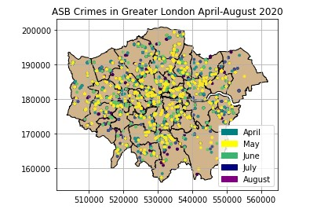
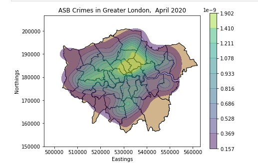
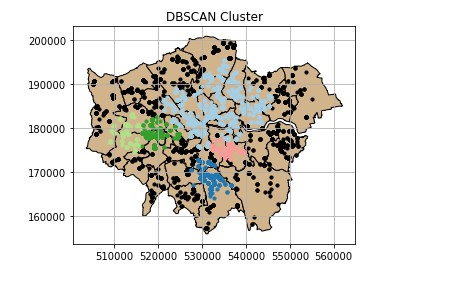
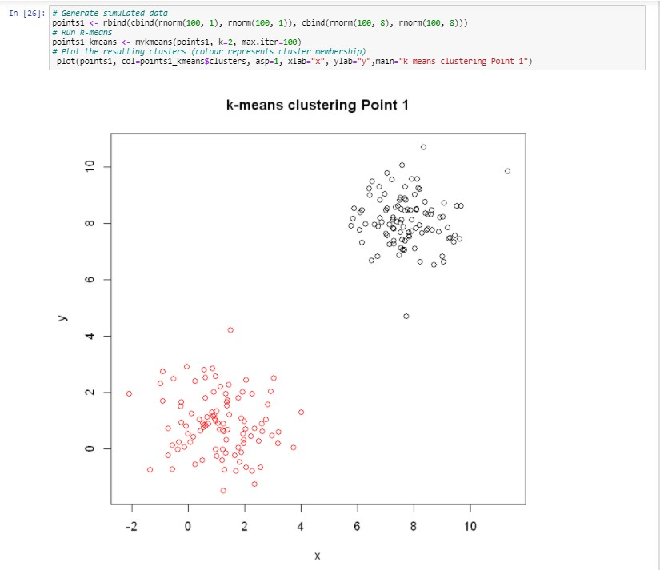

# Data Science

This repository is written in R and Python and displays a range of data science techniques, from extraction and transformation to statistical analysis techniques, for example, DBSCAN, K-means, Hierarchal clustering etc.

> Link to the Spatial Econometrics repository displaying collaborative report writing and scripting in R Markdown [Repository Link ](https://github.com/TDAYENI/Spatial-Econometrics#readme)

## Examples 
1. [A Comparison of St-DBSCAN And DBSCAN In Identifying Density Clusters of Antisocial Behaviour across Greater London (Python)](#st-dbscan-and-dbscan)
2. [K-means, DBSCAN and Hierarchical Clustering (R)](#k-means-dbscan-and-hierarchical-clustering)
3. Exploratory Data Analysis (Python)

## Examples that will be uploaded soon

*ARIMA modelling 
*SVM Classification
*Artificial Neural Networks (ANNs)-Spatial time series forecasting

## ST-DBSCAN and DBSCAN
Comparing DBSCAN and ST-DBSCAN  in analysing police antisocial behaviour (ASB) crimes in London.

| ASB Crimes in London                              	|   	|
|---------------------------------------------------	|---------------------------------------------------------------	|
| Kernel Density Estimation Of ASB Crimes In London 	|  	|
| DBSCAN Clusters of ASB Crimes In London           	|   	|

[Head back to the start](#data-Science)

# K-means, DBSCAN and Hierarchical Clustering

Basic tutorial in using R and DBSCAN, Hierarchal Clustering and K-means Machine learning techniques, the material was adapted from tutorial material cited in the repository. 

| K-means Cluster plot and code in R 	|  	|
|------------------------------------	|--------------------------------------------------------------------	|

[Head back to the start](#data-Science)

[Head back to the start](#data-Science)